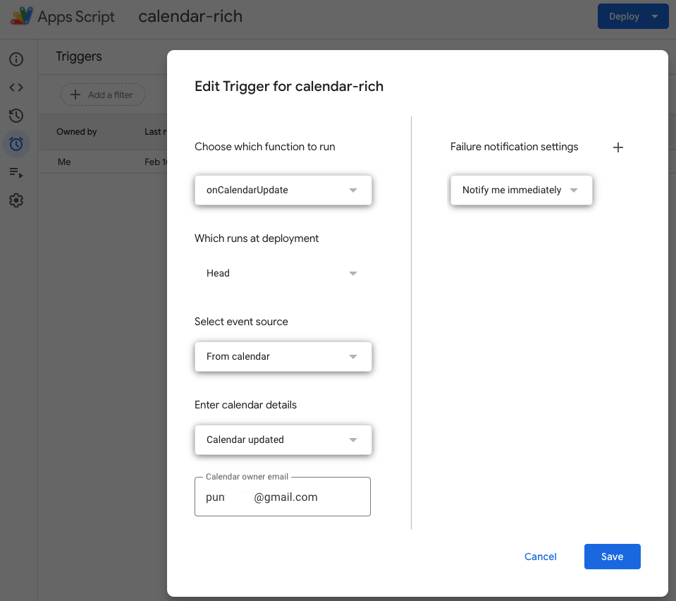

**Google Calendar Rich**
========================

Enrich Calendar events right after they get created/updated.

Installation
============
 - Create a new Google Apps Script project;
 - copy/paste the code from the file [apps-script.js](./apps-script.js);
 - in the Apps Script editor, add: Services > Google Calendar API;
 - create a Google Calendar trigger, as in .
